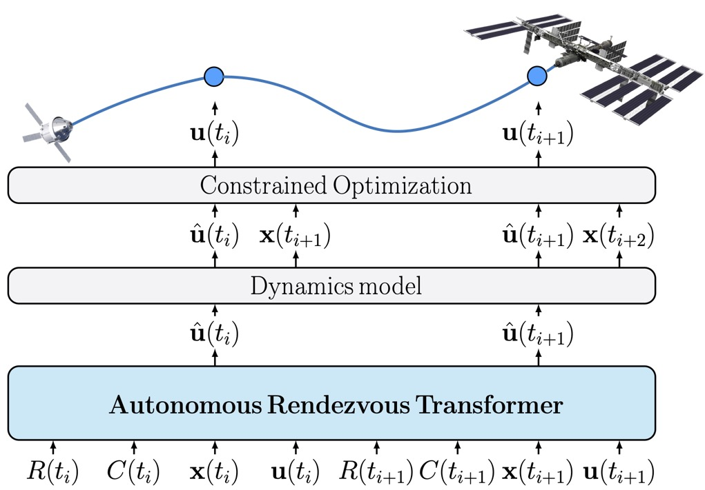

# Autonomous Rendezvous Transformer (ART)
Official implementation of "Transformers for Trajectory Optimization with Applications to Spacecraft Rendezvous". 

This [paper](https://arxiv.org/abs/2310.13831) was presented at IEEE Aerospace Conference 2024, Big Sky, Montana, USA.

</td> <br/>

## Prerequisites
To install all required dependencies, run
```
pip install -r requirements.txt
```

*Note: make sure to install a torch version that is adequate with your compute resources (e.g., CUDA versions, etc.)*

Various functionalities in this repo will require e.g., data, pre-trained weights, etc. from [this](https://drive.google.com/drive/folders/1_4UsfcMR9zUqGmg0NsX_qs3xbXXFtdgQ) link:

* `ART weights`:
    * `/checkpoint_rtn_art`: you can store this directory under `transformer/saved_files/checkpoints/`
* `Dataset files`: all other files in the Drive. you can store these under `dataset`

## Contents

* `dataset/`: stores the dataset for ART training and evaluation
* `dataset-generation/`: files to generate datasets for ART training
    * `/dataset_gen.py`: generates dataset (sequentially)
    * `/dataset_pargen.py`: generates dataset (using parallel processing)
* `dynamics/`: files defining the orbital dynamics used for the experiments
    * `/orbit_dynamics.py`: defines orbital dynamics
* `optimization/`: directory including the main scripts for the warm-starting experiments
    * `/main_optimization.py`: runs ART warm-starting for a single trajectory (Fig. 7 in the paper)
    * `/ocp.py`: implements the OCP formulations in cvxpy
    * `/rpod_scenario.py`: defines the parameters for the RPOD scenario
    * `/warmstarting_analysis.py`: runs the aggregated analysis (Fig. 4-6 in the paper)
* `transformer/`: directory implementing the main functionalities of ART
    * `/art.py`: defines the PyTorch model
    * `/main_train.py`: runs ART training
    * `/manage.py`: utility file implementing most ART functionalities 
    * `/saved_files/`: directory to store ART checkpoints

## Usage

#### Demo (i.e., using a pre-trained ART model)
To run a pre-trained ART and use it to replicate the results from Fig. 7 in the paper, (when in `/optimization/` run:

```bash
python main_optimization.py
```

If everything was installed correctly, you should see the following results printed on the screen:

```bash
Sampled trajectory [18111] from test_dataset.
CVX cost: 0.2099105243010106
CVX runtime: 0.13324236869812012  --> depends on the machine
SCP cost: 0.23537338712824057
J vect [0.26391456 0.25964526 0.25948179 0.25926714 0.25711469 0.24511094
 0.24205866 0.23998438 0.23833456 0.23693384 0.23587282 0.23567698
 0.23554822 0.23548433 0.23544705 0.23542166 0.23540354 0.23539034
 0.23538062 0.23537339]
SCP runtime: 6.200320482254028  --> depends on the machine
CVX+SCP runtime: 6.333562850952148  --> depends on the machine
GPT size: 11.1M parameters
Using ART model ' checkpoint_rtn_art ' with inference function DT_manage.torch_model_inference_dyn()
ART cost: 0.2724136
ART runtime: 0.6526541709899902 --> depends on the machine
SCP cost: 0.20998219236290414
J vect [2.09983065e-01 2.09982608e-01 2.09982192e-01 2.09982207e-01
 1.00000000e+12 1.00000000e+12 1.00000000e+12 1.00000000e+12
 1.00000000e+12 1.00000000e+12 1.00000000e+12 1.00000000e+12
 1.00000000e+12 1.00000000e+12 1.00000000e+12 1.00000000e+12
 1.00000000e+12 1.00000000e+12 1.00000000e+12 1.00000000e+12]
```

This file will also generate some representative figures and store them in `optimization/saved_files/plots`

### Training ART from scratch

To train ART from scratch, when in `/transformer/`, run:

```bash
python main_train.py
```

This will save a new model checkpoint `checkpoint_art` under `transformer/saved_files/checkpoints/`.
